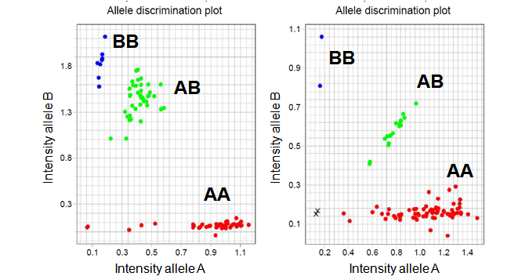

# Exploting SNP array data from GWAS: CNVs, mosaicisms and inversions

SNP array data are mainly used to perform GWAS with the aim of discovering new genetic variants associated with complex traits. There are two main values that can be obtained from SNP array data: LRR and BAF. LRR is the log-R-ratio of the two allele intensities, while BAF encodes for the frequency of the B-allele. 

The LLR is used to get genotypes calls which are obtained by using clustering methods



The joint representation of LRR and BAF may help to call CNVs and genetic mosaicisms


Lastly, running PCA or MDS of SNPs located in a candidate inversion region may help to call inversion genotypes


In this workshop, we illustrate how to perform of these analysis using R/Bioconductor packages. The required packages are:

```
library(devtools)
library(BiocManager)

install_github("isglobal-brge/brgedata")
install_github("isglobal-brge/R-GADA")
install_github("isglobal-brge/MAD")
install_github("isglobal-brge/MADloy")

install("scoreInvHap")
```

The datasets used in the presentation and in the exercises are available at BioC package `brgedata`. However, it is recommended you donwload them from `https://github.com/isglobal-brge/brgedata/tree/master/inst/extdata` to mimic real situation where the user has their own data available in a given folder from his/her computer. 


# CNVs

# Genetic Mosaicisms

# Loss of Chromosome Y

# Polymorphic inversions

