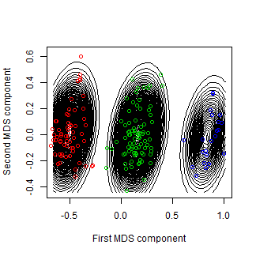

# Exploting SNP array data from GWAS: CNVs, mosaicisms and inversions

SNP array data are mainly used to perform GWAS with the aim of discovering new genetic variants associated with complex traits. There are two main values that can be obtained from SNP array data: LRR and BAF. LRR is the log-R-ratio of the two allele intensities, while BAF encodes for the frequency of the B-allele. 

The LLR is used to get genotypes calls which are obtained by using clustering methods


The joint representation of LRR and BAF may help to call CNVs and genetic mosaicisms


Lastly, running PCA or MDS of SNPs located in a candidate inversion region may help to call inversion genotypes



In this workshop, we illustrate how to perform of these analysis using R/Bioconductor packages. The required packages are:

```
library(devtools)
library(BiocManager)

install_github("isglobal-brge/brgedata")
install_github("isglobal-brge/R-GADA")
install_github("isglobal-brge/MAD")
install_github("isglobal-brge/MADloy")

install("scoreInvHap")
```

The datasets used in the presentation and in the exercises are available at BioC package `brgedata`. However, it is recommended you donwload them from `https://github.com/isglobal-brge/brgedata/tree/master/inst/extdata` to mimic real situation where the user has their own data available in a given folder from his/her computer. 


# CNVs

- The vignette describing how to perform CNV calling can be found [here](https://htmlpreview.github.io/?https://github.com/isglobal-brge/R-GADA/blob/master/vignettes/R-GADA.html).

- **Exercise:** Perform CNV calling of the samples available in the folder `data` from this repository.

# Genetic Mosaicisms

- The vignette describing how to perform mosaic calling can be found [here](https://htmlpreview.github.io/?https://github.com/isglobal-brge/R-GADA/blob/master/vignettes/MAD.html).

- **Exercise:** Perform mosaic calling of the samples available in the folder `data` from this repository.

# Mosaic loss of chromosome Y (mLOY)

- The vignette describing how to perform mLOY calling can be found [here](https://htmlpreview.github.io/?https://github.com/isglobal-brge/R-GADA/blob/master/vignettes/MADloy.html).


# Polymorphic inversions

- The vignette describing how to perform polymorphic inversion calling can be found [here](https://htmlpreview.github.io/?https://github.com/isglobal-brge/R-GADA/blob/master/vignettes/scoreInvHap.html).


- **Exercise:** Call inversion genotypes of inversion 8p23.1 from PLINK data `obesity.bed`, `obesity.fam`, `obesity.ped` which are available in the `brgedata` package. Assess the association between inversion genotypes and obesity status which is available at `obesity.txt` file (NOTE: samples are in the proper order - you do not need to sort the samples). 

Data can be downloaded into your computer by:

```
path <- system.file("extdata", package="brgedata")
snps <- read.plink(file.path(path, "obesity"))
```